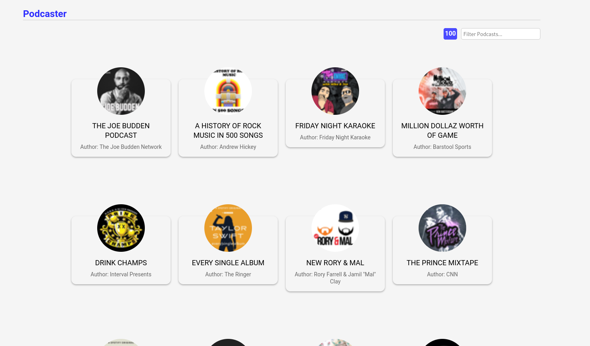
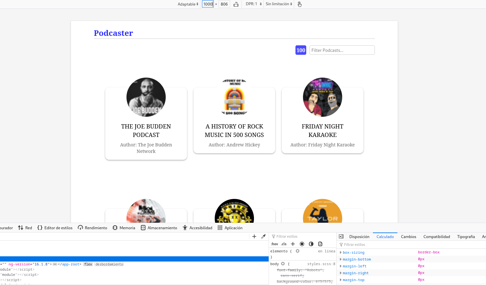
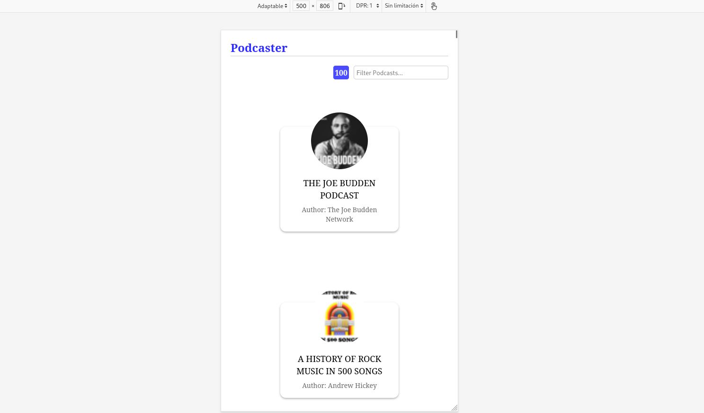
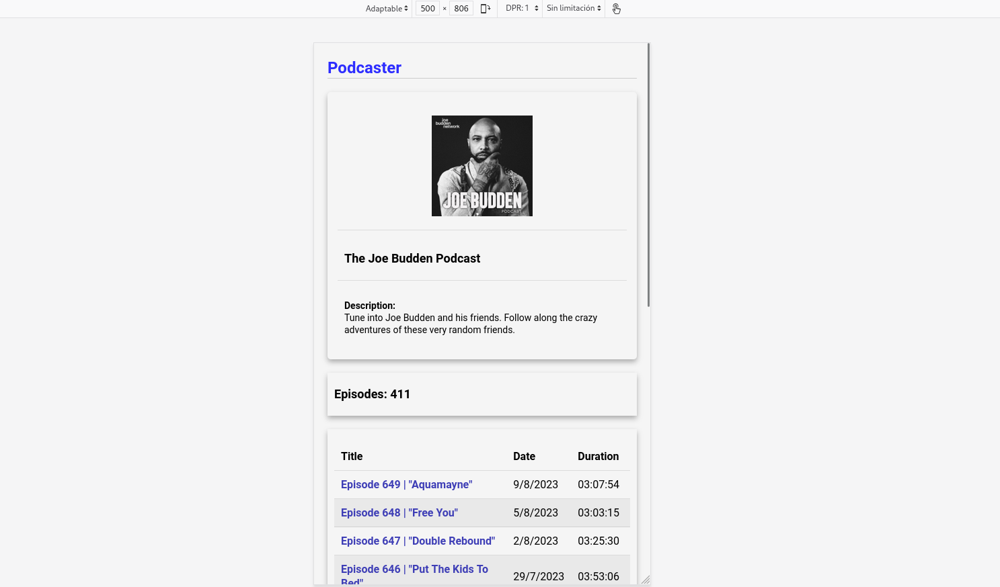

# front-end-test

This is an angular application. Its main purpose is to fetch data from the itunes API about Podcasts. 

It uses flex containers and simple media queries to be responsive. Here are some screenshots:

## Screenshots

### View 1. Desktop version

### View 1. Smaller device

### View 1. Even Smaller device

Another example!

### View 2. Desktop version

### View 2. Smaller device

## How to install it
